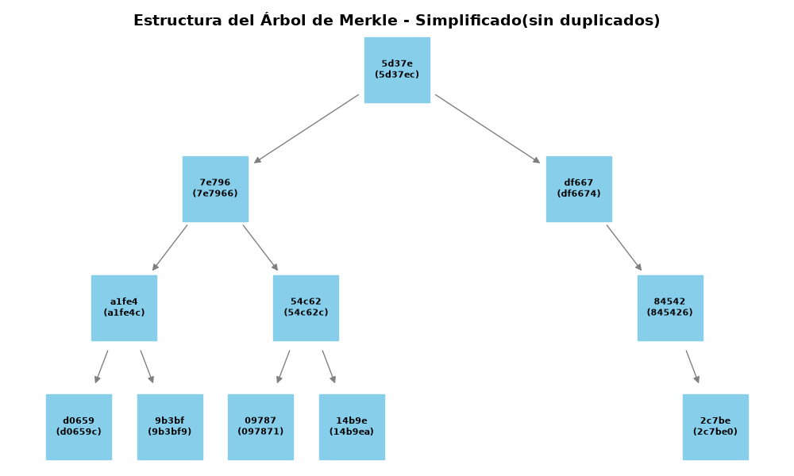
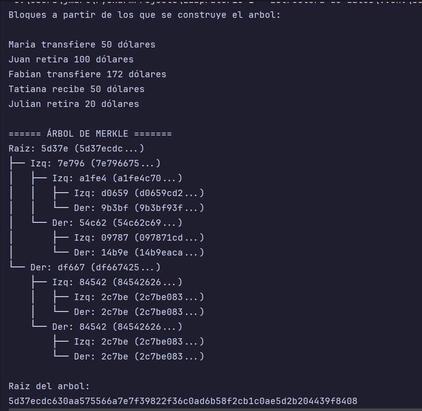
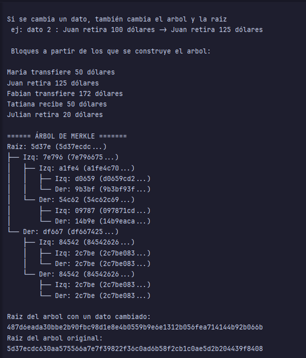
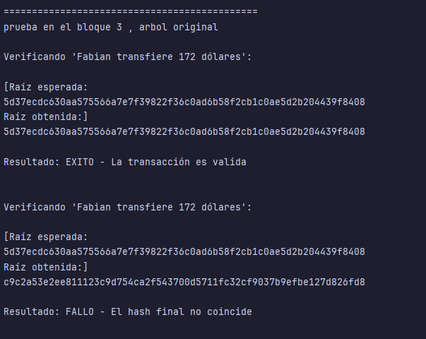

## Laboratorio 2 

### Requerimientos y librerias :
- python 3.14
- rich
- matplotlib (para el grafico)
- networkx (para el grafico)

### ***Explicación archivos***
- ***arbol_merkle.py***: Construye el arbol mediante una clase propia y lo prepara para mostrarlo en consola con rich.
- ***grafico_arbol.py***: Muestra un grafico simplificado del arbol - Generado completamente por ia 
- ***main.py***: Crea el arbol de ejemplo con transacciones simuladas, lo imprime y ejecuta pruebas 

### ***Diagrama del arbol***

        ====== ÁRBOL DE MERKLE =======
    Raíz: 5d37e (5d37ecdc...)
    ├── Izq: 7e796 (7e796675...)
    │   ├── Izq: a1fe4 (a1fe4c70...)
    │   │   ├── Izq: d0659 (d0659cd2...)
    │   │   └── Der: 9b3bf (9b3bf93f...)
    │   └── Der: 54c62 (54c62c69...)
    │       ├── Izq: 09787 (097871cd...)
    │       └── Der: 14b9e (14b9eaca...)
    └── Der: df667 (df667425...)
        ├── Izq: 84542 (84542626...)
        │   ├── Izq: 2c7be (2c7be083...)
        │   └── Der: 2c7be (2c7be083...)
        └── Der: 84542 (84542626...)
            ├── Izq: 2c7be (2c7be083...)
            └── Der: 2c7be (2c7be083...)
    
    Raiz del arbol: 
    5d37ecdc630aa575566a7e7f39822f36c0ad6b58f2cb1c0ae5d2b204439f8408
Aquí se ven las 8 hojas duplicadas(1 resultado de la primer duplicaion, 2 resultado de duplicar el hash del nivel superior a las hojas)

### ***Pruebas***
#### Cambio de la raíz al modificar un dato

#### Prueba de inclusión

#### Uso de ia: se usaron herramientas de ia para la generación de ciertas secciones de codigo, el cual fue revisado,comentado y modificado por mi antes de la implemtacion final. 